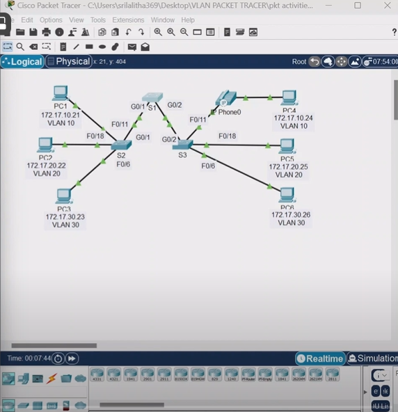

# Virtual Local Area Network (VLAN) 

* **What is VLAN ? why is important ?** 
* **What is LAN Network?**
    * A LAN is a *single Broadcast Domain*, Including all device in that Broadcast Domain
  
* **Unicast vs Broadcasting domain?**
    * Unicast:  `one to one` communication using unique IP Address
    * Broadcast : Last Ip address in the Network: `one ---> all devices`
* **Advantages of Creating VLAN?**
* **Types of VLAN**
* **Switch port vs Trunk Port**


* **virtual Local Area Network(VLAN):**
  * VLAN are how you break up your network into samller networks, so that the device and people within a single VLAN are communicating with each other and not having to manage traffic from other network.
  * VLANs are created at Layer 2 to reducing or eliminate broadcast traffic.
  * performance: Lost of unnecessary braodcast traffic can reduce network performance.


* **Benefit:**
* *smalier broadcast domains*
* Dividing a network into VLAN reduces the number of devices in the brasdcast domain
* *improved security*
* Only users in the same VLAN can comminucate together.
* Only users in the same VLAN can communicate without the services of a router. the router may have a security feature such as an access control list to restrict communications between VLANs
* *Reduced cost*
* VLANs reduce the need for expensive network upgrades and use exitng bandwith and uplinks more efficiently resulting in cost savings


### Types of VLANs
  * **Default VLAN**
  * **Data VLAN**
  * **Native VLAN**
  * **Management VLAN**
  * **Voice VLAN**

* important facts to remeber about VLAN 1 include the following:
  * All ports are assigned to VLAN 1 BY Default
  * the native VLAN is VLAN 1 by default
  * the management VLAN IS VLAN 1 by default.
  * VLAN 1 cannot be renamed of deleted


* **commands for VLAN configur**

```
Switch# show vlan brief 
```

* **1. Access Port**

  * **Purpose:** An access port connects end devices (such as workstations, pointers, or access points) to the network.
  * **Functionality:** 
      * Removes VLAN information from all frames before forwarding them 
      * Works in a single VLAN only 
      * ideal for connecting end-user devices within a specific VLAN 
  * **Example:**
      * Connecting a computer to a specific department's VLAN 
* **2. Trunk Port:**
  * **Purpose:** A trunk port connects switches or routers to extend VLANs across the network 
  * **Functionality:** 
      * Keeps VLAN information intact (tags frames with VLAN IDs)
      * carries traffic for multiple VLANs
      * Used for inter-switch connections or connections to routers/firewalls.
  * **Example:** interconnecting switch in a network with multiple VLANs
  

  * **Access Port:** Single VLAN
  * **Trunk Port:** facilitates communication between switches for `multiple VLANs` by adding and maintaining VLAN


## VLAN creation 

* check the number of vlan's availability in switch `switch# sh vlan brief`
* create VLANs using command 
* 
```
switch# config t
switch(config)# vlan 10
switch(config-vlan)# name hod
switch(config-vlan)# exit
```

* vlan ports configurations 

```
switch(config)# interface range fa0/1-2
switch(config-if-range)# switchport mode access
switch(config-if-range)# switchport access vlan 10

```

### lap setup on 

* 