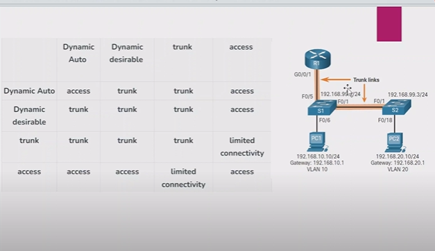

# Dynamic Trunking Protocol (DTP)

* to communicates on one swtich to anther switch using on `inter VLAN` connection.
* TO communiate the one VLAN to anther VLAN using on `Trunking protocol`

DTP 
----

* DTP is a Cisco proprietary protocol that is automatically enable on Catalyst 2960 and catalyst 3650 Series awitches. DTP works on POINT to POINT link
* some Cisco switches have a proprietary protocol that lets them autamatically negotiate trunking with a neighboring device. This protocol is called Dynamic Trunking Protocol (DTP)
* DTP can speed up the configuration process for a network administrator.
* The default DTP configuration for CISCO catalyst 2960 and 3650 switches is dynamic auto.

 **switchport mode access(DTP mode OFF)**
 
 **SWITCHPORT MODE TRUNK(DTP mode ON)**

 **switchport mode dynamic auto**
 
 **switchport mode dynamic desirable**

* using commands 
```
S1(config-if)# switch mode trunk 
S1(config-if)# switchport nonegotiate 
S1(config-if)# switchport mode dynamic auto
```
* LAB
*  

```
S1# sh interface fa0/1 switchport
S1# sh dtp
S1# sh interfaces trunk
#swtich2 
S2# sh interfaces trunk 
S2(config)# int fa0/1
S2(config-if)# switchport mode dynamic desirable
S2(config-if)# end
S2# sh int trunk

# set default interface mode 
S2(config-if)#default interface fa0/1
S2# sh interface fa0/1 switchport

```
 

#### Advantges of Dynamic Trunking Protocol (DTP)

* DTP simplifies the process of configuring and managing VLAN on a network. it enable network administrators to dynamically negotiate trunk links between switches without manual configuration.
* DTP reduces the risk of misconfiguration error and simplifies the task of managing VLANs in large networks with multiple switches.
* DTP allows for automatic creation and deletion of VLANs on switches, which can save time and reduce the risk of configuration errors.

#### Disadvantages of Dynamic Trunking Protocol (DTP)

* DTP can create security vulnerabilities in the network. it enables automatic negotiation of trunk links, which can lead to unauthorized switches being connected to the network. potentially compromising network security.
* DTP can result in increased network traffic due to the constant negotiation of trunklinks between switches.

