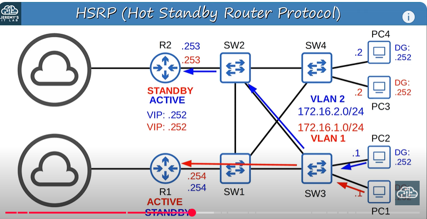

# Hot Standby Router protocol (HSRP)

* Cisco proprietary.
* An **active** and **Standby** router are elected.
* There are two version: **Version 1** and **Version 2**
  version 2 adds IPv6 support and increases the number of groups that can be configured.
* Multicast IPv4 address: v1  = 224.0.0.2
* 
                          v2  = 224.0.0.102

* Virtual MAC address:  v1 = 0000.0c07.acXX (XX = HSRP group number)

                        v2 = 0000.0c9f.fXXX (XXX = HSRP group number)
* in a situation with multiple subnets/V;ANs, you can configure a diffrent active router in each subnet/VLAN to Load balance.
* 

# Virtual Router Redundancy Protocol(VRRP)

* Open standard 
* A **Master** and **backup** router are elected.
* Multicast IPv4 address: 224.0.0.18.
* Virtual MAC address: 0000.5e00.01XX (XX = VRRP group number) `0000.5e00.01c8` (0xc8 = 200)
* in a situation with multiple subnets/VLANs, you can configure a diffrent master router in each subnet/VLAN to load balance.

# Gateway Load Balancing Protocol (GLBP)

* Cisco proprietary 
* Load balances among multi router *within a single subnet*
* An **AVG(Active Virtual Forwardes)** are assigned by the AVG (the AVG itself can be an AVF, too)
* Each AVF acts as the default gateway for a portion of the hosts in the subnet.
* multicast IPv4 address: 224.0.0.102
* Virtual MAC address: 0007.b400.XXYY (XX = GLBP group number, YY = AVF number)

#### router-1
```
R1(config)# interface GigabitEthernet0/0
R1(config-if)# ip address 192.168.1.1 255.255.255.0
R1(config-if)# standby 1 ip 192.168.1.254
R1(config-if)# standby 1 priority 110  # Optional: Set higher priority for Router 1 to be the active router
R1(config-if)# standby 1 preempt  # Optional: Allow Router 1 to preempt the active role if it comes back up
R1(config-if)# standby 1 authentication myPassword  # Optional: Set an authentication password
R1(config-if)# no shutdown

```
#### router-2

```
R2(config)# interface GigabitEthernet0/0
R2(config-if)# ip address 192.168.1.2 255.255.255.0
R2(config-if)# standby 1 ip 192.168.1.254
R2(config-if)# standby 1 priority 100  # Optional: Set lower priority for Router 2
R2(config-if)# standby 1 preempt  # Optional: Allow Router 2 to preempt the active role if it comes back up
R2(config-if)# standby 1 authentication myPassword  # Optional: Set an authentication password
R2(config-if)# no shutdown

```
##### On Router 1 and Router 2: 

```
show standby
show standby brief
```

 
