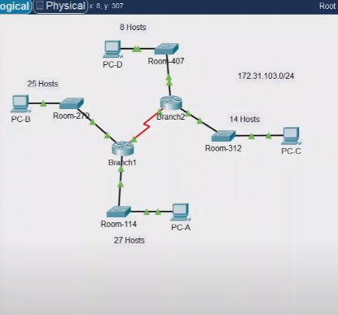
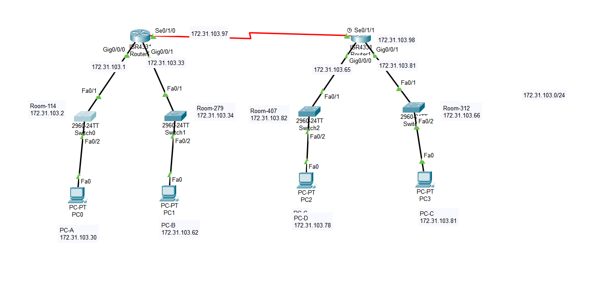
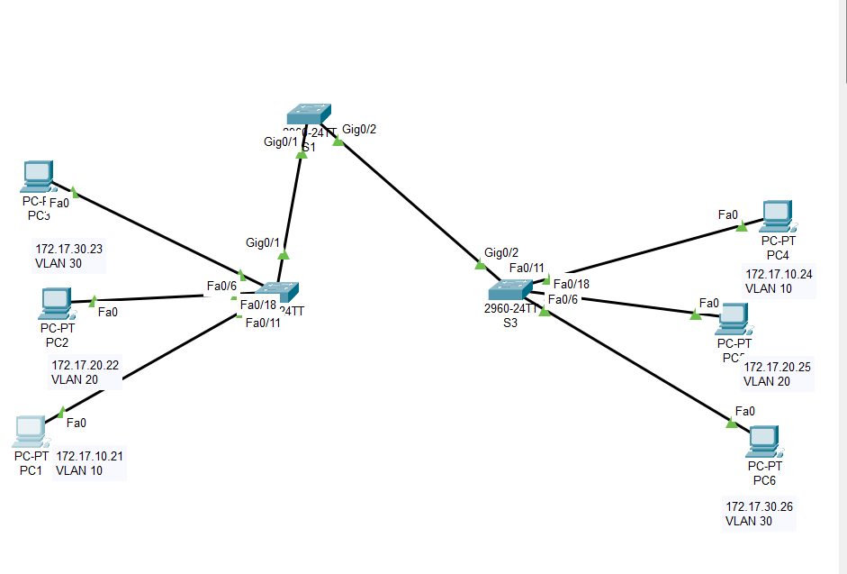
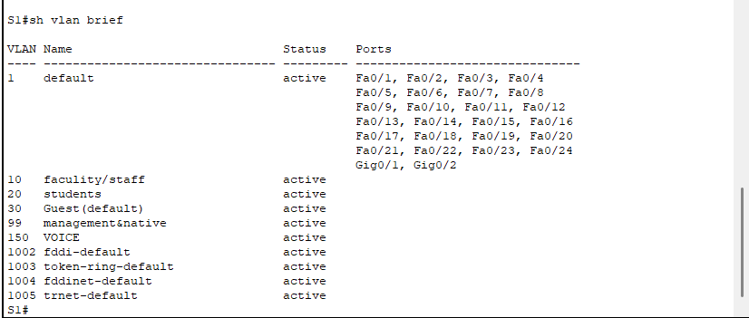

## VLSM Design and implementations practice 

### Objctive 

* Exmine the network Requirement 
* Design the VLSM addressing schema
* Assign IP Address to Devicess and verify connetivity 

### P-1

#### Step-1: Detrmine the number of subnets needed 
* you will subnet the network address 172.31.103.0/24

    * **ROOM -114:** LAN will require 27 hosts IP Addresses
    * **ROOM -279:** LAN will require 25 hosts IP Addresses
    * **ROOM -312:** LAN will require 14 hosts IP Addresses 
    * **ROOM -407:** LAN will require 8 hosts IP addresses

#### Step-2: Deterimine the subnet mask information for each subnet

a. which subnet mask will accommodata the number of IP addresses required for ROOM-114?, HOW many usabe host address will this subnet support?
b. which subnet mask will accommodata the number of IP addresses required for ROOM-279?, HOW many usabe host address will this subnet support?
c. which subnet mask will accommodata the number of IP addresses required for ROOM-312?, HOW many usabe host address will this subnet support?
d. which subnet mask will accommodata the number of IP addresses required for ROOM-407?, HOW many usabe host address will this subnet support?
e. which subnet mask will accommodata the number of IP addresses required forthe connecting between Branch-1 and Branch-2?

## p-2: Design the VLSM Addressing Scheme

#### Step-1: Divid the 172.31.103.0/24 network based on the number of hosts per subnet.

a. Use the frist subnet to accommadate the largest LAN
b. Use the Second subnet to accommadate the largest LAN 
c. Use the third subnet to accommadate the largest LAN
d. Use the fourth subnet to accommadate the largest LAN
e. Use the fifth subnet to accommadate the connection between Branch1 and Branch2

#### Step-2 subnetting table 

#### Step-3 adderssing scheme
a. Assign the usable IP addresses to Branch1 for the two LAN links and the WAN links 
b. Assign the frist usable IP addresses to Branch2 for the two LAN links. Assign the usable addresses for the WAN links 
c. Assign the second usable IP addresses to switches 
d. Assign the last usable address to the hosts

#### Step-4 Assign IP Adderesses to Devices and verify Connectivity 

step-1: configure IP addressing on the branch1 router LAN interfaces.
step-2: configure IP addresssing on the ROOM-312, switch including the default gateway 
step-3 configure IP addressing on PC-D including the default gateway.


#### design the subnetting 

* **ROOM-114:** 
    Hosts-needed: 27
    Subnet Ranges: 172.31.103.0 - 172.31.103.31
    slash: /27
    Mask: 255.255.255.224
    Hosts avaliable: 30
    Network Addresses: 172.31.103.0
    Unsed Hosts: 3
    Usable Range: 172.31.103.1 - 172.31.103.31
    Broadcost: 172.31.103.31

* **ROOM-274:** 
    Hosts-needed: 25
    Subnet Ranges: 172.31.103.32 - 172.31.103.63
    slash: /27
    Mask: 255.255.255.224
    Hosts avaliable: 30
    Network Addresses: 172.31.103.32
    Unsed Hosts: 5
    Usable Range: 172.31.103.33 - 172.31.103.62
    Broadcost: 172.31.103.63

* **ROOM-312:** 
    Hosts-needed: 14
    Subnet Ranges: 172.31.103.64 - 172.31.103.79
    slash: /28
    Mask: 255.255.255.240
    Hosts avaliable: 14
    Network Addresses: 172.31.103.64
    Unsed Hosts: 0
    Usable Range: 172.31.103.65 - 172.31.103.78
    Broadcost: 172.31.103.79

* **ROOM-407:** 
    Hosts-needed: 8
    Subnet Ranges: 172.31.103.80 - 172.31.103.95
    slash: /28
    Mask: 255.255.255.240
    Hosts avaliable: 14
    Network Addresses: 172.31.103.80
    Unsed Hosts: 6
    Usable Range: 172.31.103.81 - 172.31.103.94
    Broadcost: 172.31.103.95

* **Branches-1,2** 
    Hosts-needed: 2 
    Subnet Ranges: 172.31.103.96 - 172.31.103.99
    slash: /30
    Mask: 255.255.255.252
    Hosts avaliable:  2
    Network Addresses: 172.31.103.96
    Unsed Hosts: 0
    Usable Range: 172.31.103.97 - 172.31.103.98
    Broadcost: 172.31.103.99

Branch-1

* G0/0 -- 172.31.103.1  -- 255.255.255.224
* G0/1 -- 172.31.103.33 -- 255.255.255.224
* S0/0/0 -- 172.31.103.97 -- 255.255.255.252

Branch-2

* G0/0 -- 172.31.103.65  -- 255.255.255.240
* G0/1 -- 172.31.103.81 -- 255.255.255.240
* S0/0/0 -- 172.31.103.98 -- 255.255.255.252

Room-114 

* VLAN1 -- 172.31.103.2 -- 255.255.255.224
* Default gateway -- 172.31.103.1

Room-279

* VLAN1 -- 172.31.103.34 -- 255.255.255.224
* Default gateway -- 172.31.103.33

Room-312

* VLAN1 -- 172.31.103.66 -- 255.255.255.240
* Default gateway -- 172.31.103.65

Room-407 

* VLAN1 -- 172.31.103.82 -- 255.255.255.240
* Default gateway -- 172.31.103.81

PC-A 
* NIC -- 172.31.103.30 -- 255.255.255.224
* Default gateway -- 172.31.103.1
PC-B
* NIC -- 172.31.103.62 -- 255.255.255.224
* Default gateway -- 172.31.103.33
PC-C

* NIC -- 172.31.103.78 -- 255.255.255.240
* Default gateway -- 172.31.103.65
PC-D 
* NIC -- 172.31.103.94 -- 255.255.255.240 
* Default gateway -- 172.31.103.81



branch config(router)
-------------

```
Branch1> en 
Branch1# sh running-config
Branch1# config t
Branch1(config)# interface g0/0
Branch1(config-if)# ip address 172.31.103.1 255.255.255.224
Branch1(config-if)# no sh
Branch1(config-if)# exit 
Branch1(config)# interface g0/1
Branch1(config-if)# ip address 172.31.103.33 255.255.255.224
```
switch config(R-314)
-------------

```
Room-312> en
Room-312# config t
Room-312(config)# int vlan 1
Room-312(config-if)# ip add 172.31.103.66 255.255.255.240
Room-312(config-if)# exit
Room-312(config)# ip default-gateway 172.31.103.64
```

### vlan configuration below figure 



#### Part-1: view the default VLAN Configuration 

**Step-1: Display the current VLANs.**

* all interface the all VLAN 1 
using command `S1# sh vlan brief`

**Step-2 Verfiy connectivity between PCs on the same network**
- nOtice that each PC can ping the other PC that shares the same subnet
* PC1 can ping PC4
* PC2 can ping PC5
* PC3 can ping PC6

- ping to hosts on other network fail 


#### Part-2: Configure VLANs

* **Step-1: Create and name VLANs on S1**
* a create the following VLANs names are case-sensitive and must match the requrement exactly 
  * VLAN 10 faculity/staff
```
S1(config)# vlan 10
S1(config-vlan)# name faculity/staff
```
* creating remain vlans 
    - VLAN  20 students
    - VLAN 30 Guest(default)
    - VLAN 99 management&native
    - VLAN 150 VOICE
* creating check 
`S2# sh vlan brief`



* **Step-2: verify the VLAN configuration**
    - which command will only display the VLAN name status. and associated ports on a switch?

* **Step-3: create the VLANs on S2 and S3**
    * use the same commands from step 1 to create and name the same VLANs on S2 and S3

### Part 3: Assign VLANs to Ports

* **Step 1: Assign VLANs to the active ports on S2**

    a configure the interface as access ports ans assign the VLANs as follows

    * VLAN 10 fastEthernet 0/11

```
S2# sh vlan brief
S2(config)# interface fa0/11
S2(config)# switchport mode access
S2(config)# switchport access vlan 10 

S2(config)# interface fa0/18
S2(config)# switchport mode access
S2(config)# switchport access vlan 20 

S2(config)# interface fa0/6
S2(config)# switchport mode access
S2(config)# switchport access vlan 30

```

* **Step-2: Assign VLANs to the active ports on S3**

- VLAN 10 fa0/11
- VLAN 20 fa0/18
- VLAN 30 fa0/6

* **Step-3 verify loss of connectivity**
```
S1# sh vlan brief
# test on ping
```


# VLAN in a Multi-Switched Environment 

* **Access Port:** single VLAN
* **Trunk Port:** facilitates communication betwwen switch for `multiple VLAN` by adding and maintaing VLAN tags


