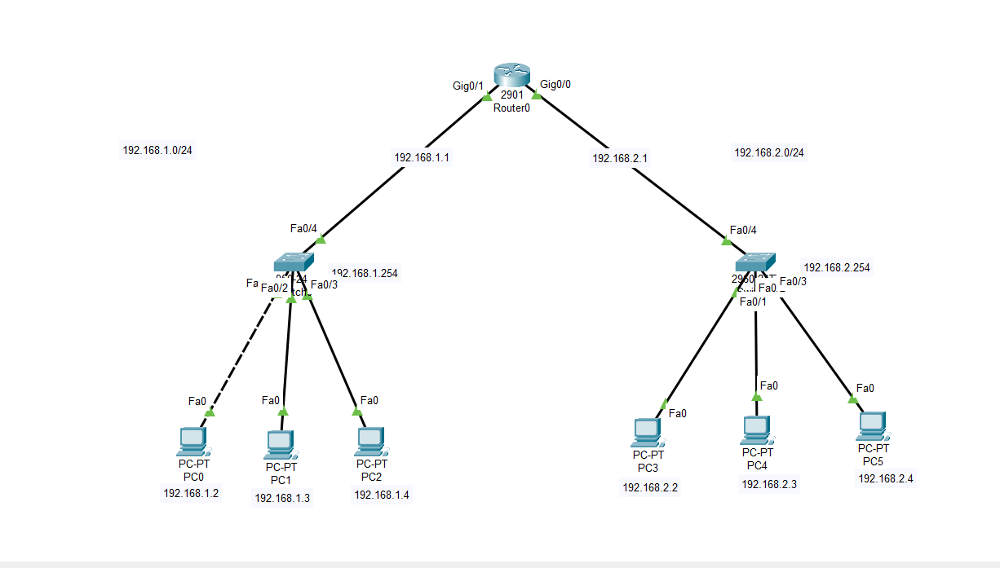

#### Router configurations 

a. Enter privileged EXEC mode by entering the *enable* command.
```
Router> enable
Router#
```
Notice that the prompt changed in the configuration to reflect privileged EXEC mode.

b. Enter the *show running-config* command

```
Router# show running-config

```
1. what is the router's hostname 
2. how many Fast Ethernet interfaces does the Router have ? ---> 4
3. How many Gigabit Ethernet interfaces does the Router have? ---> 2
4. How many serial interfaces does the router have?  --> 2
5. What is the range of values shown for the vty lines ?

c. Display the current contents of NVRAM.
```
Router# show startup-config
```
startup is not present
1. Why does the router respond with the startup-config is not present message?

* change the host name 

```
Router# config t
Router(config)# hostname R1
Router(config)# banner motd @Unauthorized access is strictly prohitbited@
```
* set the password router, encrypted and set the console.

```
Router(config)# service password-encryption
Router(config)# enable password cisco 
Router(config)# enable secret dhille
# set the console password 
Router(config)# line console 0
Router(config-line)# password letmein
Router(config-line)# login 
Router(config-line)# exit

```
* save the configurations router what command is used 

# when to use switch and when to use router in networking 

* **what is same network**
    - Are connected to the same LAN
    - using only Same IP Address/ CIDR Range 

* what is diffrent network 
* **when to use ROUTER (layer-3) -- IP Address**
    - to communicate between two diffrent network 
* when to use Switch (layer-2) -- MAC/Physical address 
* configuration of VLAN to switch 



* **LAB SETUP**

```
Router> en
Router# config t
Router(config)# interface g0/0
Router(config-if)# ip address 192.168.1.1 255.255.255.0
Router(config-if)# no sh
Router(config-if)# exit 

Router# config t
Router(config)# interface g0/1
Router(config-if)# ip address 192.168.2.1 255.255.255.0
Router(config-if)# no sh
Router(config-if)# exit 
```

* **VLAN configuration**

```
Switch > en
Switch# sh vlan 
Switch# config t
Switch(config)# int vlan 1 
Switch(config-if)# ip address 192.168.1.254 255.255.255.0
Switch(config-if)# no sh 
Switch(config-if)# exit
Switch(config)# ip default-gatway 192.168.1.1
Switch# sh running-config
```